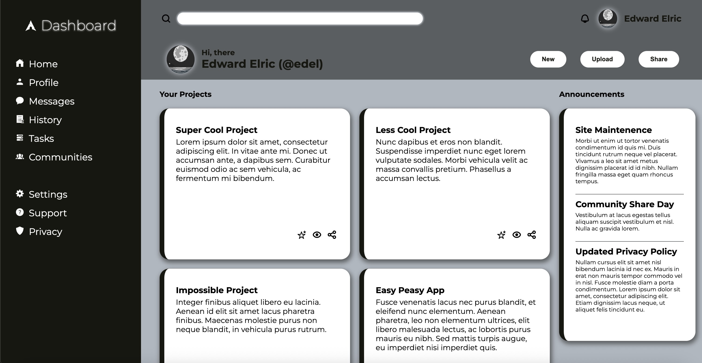

# Admin Dashboard

A fully responsive and interactive **Admin Dashboard** web application built with **HTML**, **CSS**, and **JavaScript**.  
Designed and developed by [@daanniill](https://github.com/daanniill).


---

## 📋 Features

- **Responsive Sidebar Navigation**  
  - Links for Home, Profile, Messages, History, Tasks, Communities.  
  - Secondary navigation for Settings, Support, Privacy.

- **Interactive Header**  
  - Search bar with icon.  
  - User profile section with notifications.

- **Main Content Area**  
  - Project cards with hover animations.  
  - Scrollable project descriptions.  
  - Quick action icons (favorite, watch, share).

- **Right Sidebar**  
  - Announcements section with multiple updates.  
  - Trending users list with profile images.

- **Modern UI Styling**  
  - Custom color variables for easy theme management.  
  - Card hover effects and smooth transitions.  
  - Flexbox & CSS Grid layout for responsive design.

---

## 📂 Project Structure

```
admin-dashboard/
│
├── assets/              # Icons, images, and other media
│   ├── home.png
│   ├── user.png
│   ├── message.png
│   ├── ...
│
├── index.html           # Main HTML file
├── styles.css           # Stylesheet for layout & components
├── scripts.js           # JavaScript for interactivity
└── README.md            # Project documentation
```

---

## 🚀 Getting Started

### 1️⃣ Clone the Repository
```bash
git clone https://github.com/daanniill/admin-dashboard.git
cd admin-dashboard
```

### 2️⃣ Open in Browser
Simply open the `index.html` file in your preferred browser.

---

## 🛠️ Technologies Used

- **HTML5** – Structure and semantic layout
- **CSS3** – Responsive design, animations, and theming
- **JavaScript (Vanilla)** – UI interactivity
- **Google Fonts** – Montserrat & Bytesized font

---

## 🎯 Future Improvements

- Make project cards fully editable
- Add dark mode toggle

---

## 📌 Author

**Daniil**  
GitHub: [@daanniill](https://github.com/daanniill)

---

## 📜 License

This project is open-source and available under the [MIT License](LICENSE).
